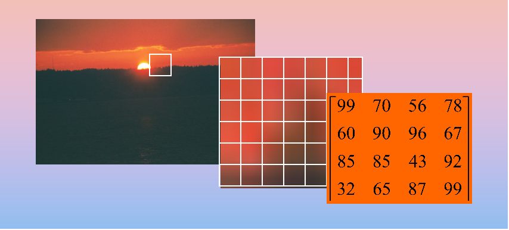
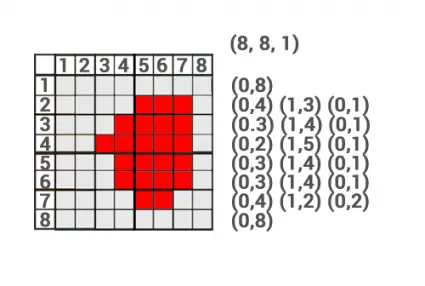

## Apa itu image compression?

<div style="text-align: justify">
Sering kali dalam kehidupan sehari-hari kita menggunakan citra/gambar baik itu untuk keperluan akademik maupun sosial media namun apakah kita tahu bahwa sebenarnya citra digital yang kita gunakan sebenarnya merupakan interpretasi dari matriks, ya matriks yang sering kita pelajari dulu ketika di SMA. Sebuah citra digital merupakan matriks dua hingga tiga dimensi. Untuk citra hitam putih & grayscale sendiri tersusun dari matriks dua dimensi sedangkan citra berwarna (RGB) tersusun dari matriks tiga dimensi. Tahukan kamu bahwa hasil citra pada kamera sebenarnya berformat RAW?, citra berformat RAW ini memiliki ukuran yang besar sehingga perlu dimampatkan (kompres). Pemampatan ini bertujuan untuk mengurangi ukuran file agar lebih efisien. Secara garis besar ada dua teknik kompresi pada citra, yaitu lossless dan lossy. Pada teknik kompresi lossless citra akan direkonstruksi secara sempurna tanpa mengurangi kualitas citra sedangkan teknik kompresi lossy compression atau juga disebut irreversible compression merupakan teknik kompresi yang menggunakan perkiraan yang tidak tepak dan membuang sebagian data untuk mewakili konten. 
</div>



## Konsep RLE (Run Length Encoding)
<div style="text-align: justify">
RLE (Run Length Encoding) merupakan salah satu teknik kompresi lossless yang paling mudah dipraktikkan. Konsep RLE Compression adalah dengan memeriksa pengulangan nilai pixel yang terjadi berturut-turut. Algoritma ini dapat bekerja dengan efisien pada citra biner.

Mari kita ambil contoh citra [ 0 1 1 1 1 1 0 0 0 0 0 0 1 1 1 0 0 0 1 1 1 ] memiiki 21 pixel dan terdiri dari binary. Untuk menggunakan algoritma RLE langkah - langkah yang perlu kita lakukan sebagai berikut.
1. Langkah awal, pointer saat ini ada pada pixel pertama yaitu  0 . Kemudian kita kompresi menjadi [01] yang artinya 0 diulang sebanyak 1 kali.
2. Selanjutnya bernilai 1 yang diulang sebanyak 5 kali setelah itu kita gabungkan pada hasil kompresi sebelumnya menjadi [01 15].
3. Kemudian bernilai 0 yang diulang sebanyak 6 kali dan kita gabungkan dengan hasil kompresi sebelumnya menjadi [01 15 06].
4. Ulang langkah sebelumnya sampai dengan pixel terakhir.
5. Hasil RLE [01 15 06 13 03 13]
Citra sebelumnya memiliki 21 nilai sekarang setelah dikompress menjadi 6 nilai.

Sekarang untuk mendekompresi atau mengembalikan nilai semula yaitu,
1. Nilai awal yaitu 01, yang berarti 0 diulang sebanyak satu kali. Menghasilkan [1].
2. Selanjutnya yaitu 15. Kita lakukan seperti sebelumnya, dan digabung dengan hasil sebelumnya menghasilkan [0 1 1 1 1 1].
3. Dan seterusnya.
</div>



## Implementasi pada Python

### Persiapan Awal

Import dependensi dan deklarasi fungsi pendukung yang akan kita gunakan.
```python
import numpy as np
import cv2
import matplotlib.pyplot as plt
import sys
import os

def show(img, cmap='gray', figsize=(10, 10), title=""):
    # fungsi untuk menampilkan citra
    figure=plt.figure(figsize=figsize)
    plt.title(title)
    plt.imshow(img, cmap=cmap)
    plt.show()
```

### Fungsi Encoding
```python
# read graysclae img
def RLE_encoding(img, bits=8,  binary=True, view=True):
    """
    img: Grayscale img.
    bits: what will be the maximum run length? 2^bits       
    """
    if binary:
        ret,img = cv2.threshold(img,127,255,cv2.THRESH_BINARY+cv2.THRESH_OTSU)

    if view:
        show(img)

    encoded = []
    shape=img.shape
    count = 0
    prev = None
    fimg = img.flatten()
    th=127
    for pixel in fimg:
        if binary:
            if pixel<th:
                pixel=0
            else:
                pixel=1
        if prev==None:
            prev = pixel
            count+=1
        else:
            if prev!=pixel:
                encoded.append((count, prev))
                prev=pixel
                count=1
            else:
                if count<(2**bits)-1:
                    count+=1
                else:
                    encoded.append((count, prev))
                    prev=pixel
                    count=1
    encoded.append((count, prev))
    
    return np.array(encoded)
```
### Fungsi Decoding
```python alkjflak
# decode
def RLE_decode(encoded, shape):
    decoded=[]
    for rl in encoded:
        r,p = rl[0], rl[1]
        decoded.extend([p]*r)
    dimg = np.array(decoded).reshape(shape)
    return dimg
```

```python
uauihdfuhakdh
```
```javascript
console.log('Code Tab A');
```


### RLE Citra RGB


<ul class="nav nav-tabs">
    <li class="active"><a data-toggle="tab" href="#home">Home</a></li>
    <li><a data-toggle="tab" href="#menu1">Menu 1</a></li>
    <li><a data-toggle="tab" href="#menu2">Menu 2</a></li>
    <li><a data-toggle="tab" href="#menu3">Menu 3</a></li>
</ul>
<div class="tab-content">
<div id="home" class="tab-pane fade in active">
    <p>Lorem ipsum dolor sit amet, consectetur adipisicing elit, sed do eiusmod tempor incididunt ut labore et dolore magna aliqua.</p>
</div>
<div id="menu1" class="tab-pane fade">
</div>
<div id="menu2" class="tab-pane fade">
    
```javascript
console.log('Code Tab A');
```  


</div>
<div id="menu3" class="tab-pane fade">
    <p>Eaque ipsa quae ab illo inventore veritatis et quasi architecto beatae vitae dicta sunt explicabo.</p>
</div>
</div>


 

```javascript
console.log('Code Tab A');
```  

 

kjhakdjhfkjahkjhdkf

lakjdfjalksdj

 

kjhakdjhfkajhsd

 